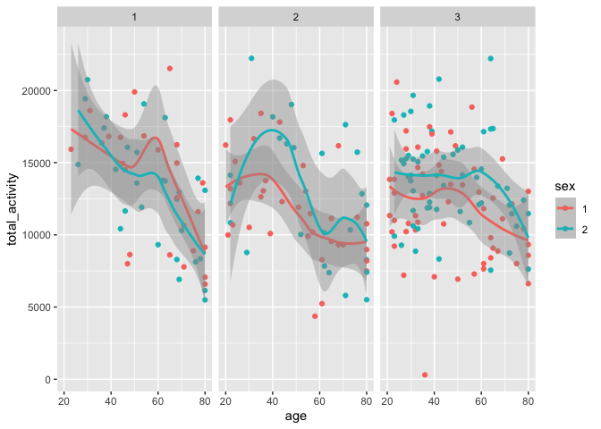

p8105_hw3_cev2129
================
2024-10-16

\#Question 2 Loading the Nhanes_covar.csv

``` r
library(tidyverse)
```

    ## ── Attaching core tidyverse packages ──────────────────────── tidyverse 2.0.0 ──
    ## ✔ dplyr     1.1.4     ✔ readr     2.1.5
    ## ✔ forcats   1.0.0     ✔ stringr   1.5.1
    ## ✔ ggplot2   3.5.1     ✔ tibble    3.2.1
    ## ✔ lubridate 1.9.3     ✔ tidyr     1.3.1
    ## ✔ purrr     1.0.2     
    ## ── Conflicts ────────────────────────────────────────── tidyverse_conflicts() ──
    ## ✖ dplyr::filter() masks stats::filter()
    ## ✖ dplyr::lag()    masks stats::lag()
    ## ℹ Use the conflicted package (<http://conflicted.r-lib.org/>) to force all conflicts to become errors

``` r
library(dplyr)
library(ggplot2)
covar_df = read_csv(file = "nhanes_covar.csv", skip = 4, col_names = TRUE, na = c(".", "NA", ""))
```

    ## Rows: 250 Columns: 5
    ## ── Column specification ────────────────────────────────────────────────────────
    ## Delimiter: ","
    ## dbl (5): SEQN, sex, age, BMI, education
    ## 
    ## ℹ Use `spec()` to retrieve the full column specification for this data.
    ## ℹ Specify the column types or set `show_col_types = FALSE` to quiet this message.

``` r
covar_df = drop_na(covar_df)
```

Loading Nhanes_accel.csv

``` r
accel_df = read_csv(file = "nhanes_accel.csv")
```

    ## Rows: 250 Columns: 1441
    ## ── Column specification ────────────────────────────────────────────────────────
    ## Delimiter: ","
    ## dbl (1441): SEQN, min1, min2, min3, min4, min5, min6, min7, min8, min9, min1...
    ## 
    ## ℹ Use `spec()` to retrieve the full column specification for this data.
    ## ℹ Specify the column types or set `show_col_types = FALSE` to quiet this message.

``` r
accel_df = drop_na(accel_df)
```

Joining the datasets

``` r
nhanes_df = left_join(covar_df, accel_df, by = "SEQN", "age" > 21)
nhanes_df = nhanes_df |>
  mutate_all(as.character) 
```

Create a reader friendly table for number of men and women in each
education category, and

``` r
nhanes_df |> 
  group_by(education, sex) |>      
  count() |>                      
  arrange(education)
```

    ## # A tibble: 6 × 3
    ## # Groups:   education, sex [6]
    ##   education sex       n
    ##   <chr>     <chr> <int>
    ## 1 1         1        27
    ## 2 1         2        28
    ## 3 2         1        36
    ## 4 2         2        23
    ## 5 3         1        56
    ## 6 3         2        59

``` r
#This table shows how many people from each sex has completed each level of education. Education level is shown twice so that it can be separated by sex. 
```

Create a visualization of the age distributions for men and women in
each education category.

``` r
nhanes_df = nhanes_df |>
  mutate(sex= as.factor(sex), education = as.factor(education), age = as.numeric(age))

ggplot(nhanes_df, aes(x= sex, y = age)) +   
  geom_boxplot() +           
  facet_wrap(~education)
```

<!-- -->

``` r
#This box plot is meant to show what the reader friendly table depicts, howver you can more clearly view the distribtion of each sex in each education level. 
```

Using your tidied dataset, aggregate across minutes to create a total
activity variable for each participant. Plot these total activities
(y-axis) against age (x-axis); your plot should compare men to women and
have separate panels for each education level. Include a trend line or a
smooth to illustrate differences. Comment on your plot.

``` r
nhanes_df <- nhanes_df |>
  mutate(total_activity = rowSums(across(min1:min1440, ~ as.numeric(.)), na.rm = TRUE))

ggplot(nhanes_df, aes(x = age, y = total_activity, color = sex)) + 
  geom_point() + geom_smooth() +
  facet_wrap(~ education)
```

    ## `geom_smooth()` using method = 'loess' and formula = 'y ~ x'

<!-- -->

``` r
#These plots show the differences in physical activity throughtout the day between those of different sex and ages, separated by education. Each level of education has a downward trend, however, those in the highest level of education seem to have the least steep slope. 
```

Accelerometer data allows the inspection activity over the course of the
day. Make a three-panel plot that shows the 24-hour activity time
courses for each education level and use color to indicate sex. Describe
in words any patterns or conclusions you can make based on this graph;
including smooth trends may help identify differences.

\#Question 3

``` r
jan2020 = read_csv("Jan2020.csv")
```

    ## Rows: 12420 Columns: 7
    ## ── Column specification ────────────────────────────────────────────────────────
    ## Delimiter: ","
    ## chr (6): ride_id, rideable_type, weekdays, start_station_name, end_station_n...
    ## dbl (1): duration
    ## 
    ## ℹ Use `spec()` to retrieve the full column specification for this data.
    ## ℹ Specify the column types or set `show_col_types = FALSE` to quiet this message.

``` r
jan2024 = read_csv("Jan2024.csv")
```

    ## Rows: 18861 Columns: 7
    ## ── Column specification ────────────────────────────────────────────────────────
    ## Delimiter: ","
    ## chr (6): ride_id, rideable_type, weekdays, start_station_name, end_station_n...
    ## dbl (1): duration
    ## 
    ## ℹ Use `spec()` to retrieve the full column specification for this data.
    ## ℹ Specify the column types or set `show_col_types = FALSE` to quiet this message.

``` r
july2020 = read_csv("July2020.csv")
```

    ## Rows: 21048 Columns: 7
    ## ── Column specification ────────────────────────────────────────────────────────
    ## Delimiter: ","
    ## chr (6): ride_id, rideable_type, weekdays, start_station_name, end_station_n...
    ## dbl (1): duration
    ## 
    ## ℹ Use `spec()` to retrieve the full column specification for this data.
    ## ℹ Specify the column types or set `show_col_types = FALSE` to quiet this message.

``` r
july2024 = read_csv("July2024.csv")
```

    ## Rows: 47156 Columns: 7
    ## ── Column specification ────────────────────────────────────────────────────────
    ## Delimiter: ","
    ## chr (6): ride_id, rideable_type, weekdays, start_station_name, end_station_n...
    ## dbl (1): duration
    ## 
    ## ℹ Use `spec()` to retrieve the full column specification for this data.
    ## ℹ Specify the column types or set `show_col_types = FALSE` to quiet this message.
